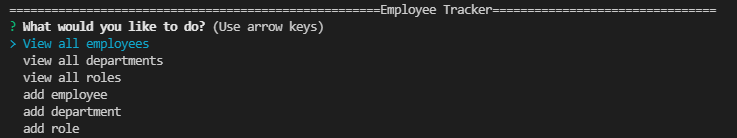

# Employee Tracker

* Hello this application is ran through node.js using inquirer and sql!
* If you clone the repo you can npm i in the root folder then run the application with node index!

# Tech Used 
 
 * Uses node.js sql and inquirer

# Video 

https://watch.screencastify.com/v/8oAThIyYM9DNKdPi4OHq

# W.I.P.

Still need to implement adding employees, department, and roles!
